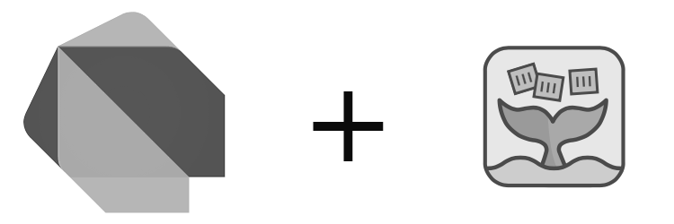

# Dart OpenFaaS function templates

<p align="center">
  
</p>

This repository contains [OpenFaaS](https://github.com/openfaas) function templates for writing serverless functions in the [Dart](https://github.com/gleam-lang/gleam) programming language.


## Usage

1. Make sure OpenFaaS has been deployed to your Kubernetes cluster and the OpenFaaS CLI tool has been installed. See [here](https://github.com/NicklasXYZ/selfhosted-serverless) and [here](https://github.com/NicklasXYZ/selfhosted-serverless/blob/main/OpenFaaS.md) for a brief introduction on how to do this.

2. Download the Dart function templates from this repo:

```
faas-cli template pull https://github.com/nicklasxyz/dart_openfaas#main
```

3. Create a new function:

``` bash
faas-cli new --lang dart test-function
```

Note: This essentially creates a usual Dart project stucture, but with a pre-defined package name and files. The main functionality should be implemented in the files contained in the newly created `test-function/function` directory. Extra dependencies should be added to the respective`pubspec.yaml` files in the root of the `test-function` or the `test-function/function` directory. The project can be compiled and tested locally as usual. See the forllowing [README.md](template/README.md) for more information.

4. Add new functionality to the function that is going to be deployed and managed by OpenFaaS:

``` bash
code test-function/function/src/function.gleam
# ... Extend or add whatever you want to the file
```

5. Make sure a valid container registry, to where functions can be pushed, has been defined in the `test-function.yml` file:

``` bash
code test-function.yml
```

6. Finally, build, push and deploy the function:

```bash
# Authenticate with OpenFaaS (assuming kubectl is used with the k3s Kubernetes distribution):
PASSWORD=$(k3s kubectl -n openfaas get secret basic-auth -o jsonpath="{.data.basic-auth-password}" | base64 --decode) && \
echo "OpenFaaS admin password: $PASSWORD"
faas-cli login --gateway http://localhost:31112 --password=$PASSWORD

# Build, push and deploy:
faas-cli build -f test-function.yml
faas-cli push -f test-function.yml
faas-cli deploy -f test-function.yml --gateway=http://localhost:31112

# ... or just:
faas-cli up -f test-function.yml --gateway=http://localhost:31112

# To remove function deployments run:
faas-cli remove -f test-function.yml --gateway=http://localhost:31112
```

7. Wait a few seconds, then we can invoke the function by sending a request through curl:

```bash
### Example GET request
curl -k \
  -X GET http://localhost:31112/function/test-function; \
  echo

# If nothing was changed in the 'test-function/function' directory before
# deployment then we should just see the default response:
>> Hello from Gleam & OpenFaaS!

### Example POST request:
curl -k \
  -d "{\"name\": \"Peter\", \"age\": \"42\", \"height\": \"180.5\"}" \
  -H "Content-Type: application/json" \
  -X POST http://localhost:31112/function/test-function; \
  echo

# If nothing was changed in the 'test-function/function' directory before
# deployment then we should just see the default response:
>> [{"string_field":"Peter"}, {"int_field":42}, {"double_field":180.5}]
```

8. If we just want to check that the requests were handled properly then we can check the logs:

```bash
faas-cli logs test-function --gateway http://localhost:31112
```

The function can also be invoked through the public interface at `http://localhost:31112/ui/` using username `admin` and the previously defined password contained in environment variable `$PASSWORD`.
